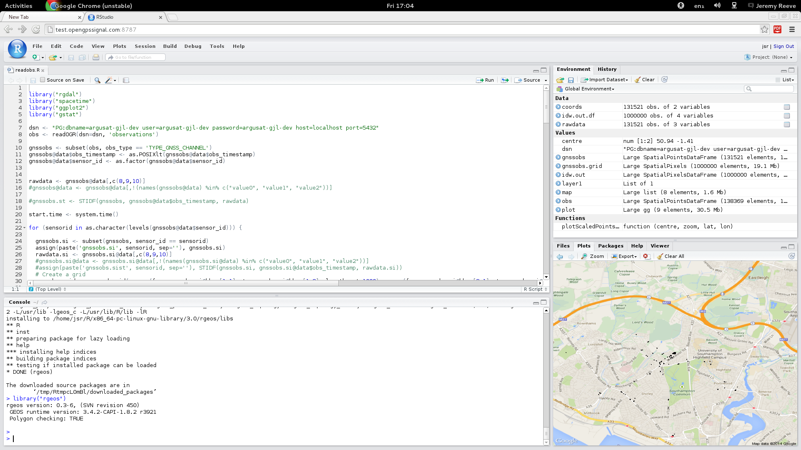

# README #

### What is this repository for? ###

* This repository contains the server-side components of the __GNSS Jammer Locator__ distributed system suite
* Current Version:  1.0.6
* [Learn Markdown](https://bitbucket.org/tutorials/markdowndemo)

### Architecture ###

### How do I get set up? ###

* Install system packages or rather dependencies that are not managed by Maven.

        Describes system configuration for a Ubuntu 16.04 system

        `apt install postgresql postgresql-client postgresql-contrib postgis libpostgis-java git maven openjdk-8-jdk rabbitmq-server protobuf-complier`

* RabbitMQ configuration

        As user rabbitmq,

        `rabbitmqctl add_user argusat-gjl-dev argusat-gjl-dev`
        `rabbitmqctl set_permissions -p / argusat-gjl-dev ".*" ".*" ".*"`

* Database configuration:

        createuser --no-superuser --no-createdb --no-createrole --pwprompt argusat-gjl-dev

        createdb --owner argusat-gjl-dev argusat-gjl-dev

        psql -d argusat-gjl-dev

        CREATE EXTENSION postgis;
        CREATE EXTENSION postgis_topology;

* Initialise the database

        cd observation-service
        psql -U argusat-gjl-dev -h localhost < src/main/resources/initdb.sql

        cd ../device-service
        psql -U argusat-gjl-dev -h localhost < src/main/resources/initdb.sql

* Build the services

        mvn package install

        mvn clean compile assembly:single

* To run individual services

        mvn -DskipTests=true -Djersey.test.port=9998 -Dcom.argusat.gjl.observice.debug=true -e exec:java

* Configure Eclipse and the dev environment

        mvn eclipse:clean
        mvn eclipse:eclipse

    Set `M2_REPO` classpath variable:

        mvn -Declipse.workspace="/Users/jsr/dev/gjl_service_eclipse" eclipse:configure-workspace

* Dependencies: `mvn depends-tree-or-something`.  When rebuilding with new dependencies and prior to deployment, one should execute `mvn dependency:build-classpath -DincludeScope=runtime` and use that to set the classpath in the relevant start script.  FIXME properly.

* How to run tests:  `mvn test` 

        Code run under JRE 1.8, which is true for these instructions, causes tests to fail due to javax.annotations-version defaulting to 1.2 under this JRE.  Tests are being forked from Maven so a workaround for running tests by forcing test not to fork.

        mvn -DforkCount=0 -Djavax.annotation-version=1.1 test

* Deployment instructions:

        apt-get install tomcat7

        usermod -U myuid --append -G tomcat7

        mvn -DskipTests=true compile war:exploded

    * Run the start script to to start the RabbitMQ instance with 
    * Run the start scripts to start the Device Service `start-device-server.sh`
    * Run the start scripts to start the Observation Service `start-observation-server.sh`
    * Run the start scripts to start the Locator Service `start-locator-server.sh`

### Some Data Analysis in R ###

There is some R code which interfaces with the data store provided.  Here's a screenshot:

### Contribution guidelines ###

* Writing tests
* Code review
* Other guidelines

### Who do I talk to? ###

* jeremy.reeve@opengpssignal.com