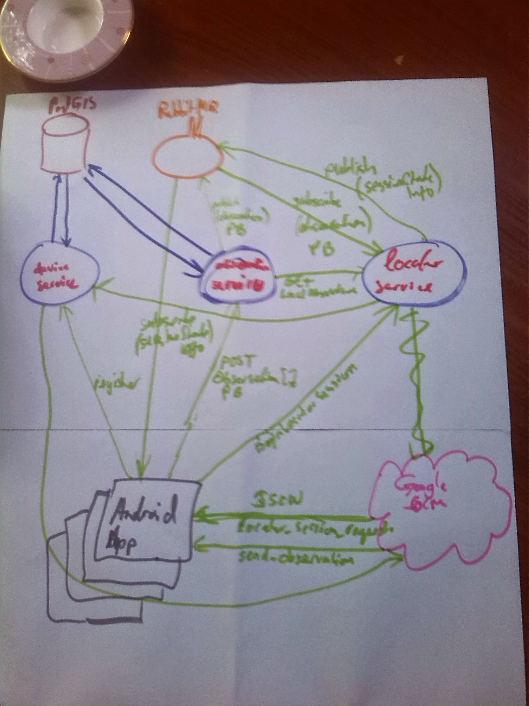

# README #

### What is this repository for? ###

* This repository contains the server-side components of the __GNSS Jammer Locator__ distributed system suite
* Version
* [Learn Markdown](https://bitbucket.org/tutorials/markdowndemo)

Architecture




### How do I get set up? ###

* Install system packages or rather dependencies that are not managed by Maven.

        apt-get install postgresql postgresql-client postgresql-contrib postgresql-9.3-postgis-2.1 git maven openjdk-7-jdk rabbitmq-server`

* RabbitMQ configuration

        rabbitmqctl add_user argusat-gjl-dev argusat-gjl-dev
        rabbitmqctl set_permissions -p / argusat-gjl-dev ".*" ".*" ".*"


* Building postgis-jdbc.jar


    * Mac OS X 

        modify jdbc/Makefile to set ant path correctly.  Hmmm.  Actually, invoke `mvn` directly because the ant-maven-tasks integration does something funky with `M2_HOME` by the looks of things.


        build postgis-2.1.x and mvn install the jar.  Using postgis-2.1.2 so that generated postgis-jdbc.jar matches already installed postgis version install from source following these instructions [UsersWikiPostGIS21Ubuntu1404src](http://trac.osgeo.org/postgis/wiki/UsersWikiPostGIS21Ubuntu1404src)

        stop after make step.

````
  PostGIS is now configured for x86_64-unknown-linux-gnu

 -------------- Compiler Info ------------- 
  C compiler:           gcc -g -O2
  C++ compiler:         g++ -g -O2
  SQL preprocessor:     /usr/bin/cpp -w -traditional-cpp -P

 -------------- Dependencies -------------- 
  GEOS config:          /usr/bin/geos-config
  GEOS version:         3.4.2
  GDAL config:          /usr/bin/gdal-config
  GDAL version:         1.10.1
  PostgreSQL config:    /usr/bin/pg_config
  PostgreSQL version:   PostgreSQL 9.3.4
  PROJ4 version:        48
  Libxml2 config:       /usr/bin/xml2-config
  Libxml2 version:      2.9.1
  JSON-C support:       yes
  PostGIS debug level:  0
  Perl:                 /usr/bin/perl

 --------------- Extensions --------------- 
  PostGIS Raster:       enabled
  PostGIS Topology:     enabled
  SFCGAL support:       disabled

 -------- Documentation Generation -------- 
  xsltproc:             /usr/bin/xsltproc
  xsl style sheets:     /usr/share/xml/docbook/stylesheet/nwalsh
  dblatex:              
  convert:              
  mathml2.dtd:          /usr/share/xml/schema/w3c/mathml/dtd/mathml2.dtd

````

        modify `liblwgeom/lwin_geojson.c`

        json ->  json-c

            #include <json-c/json.h> -> #include <json-c/json_object_private.h>`

            cd java
            make

            mvn install:install-file -Dfile=../../depends/postgis-2.1.2/java/jdbc/target/postgis-jdbc-2.1.2.jar -DgroupId=org.postgis -DartifactId=postgis-jdbc -Dpackaging=jar -Dversion=2.1.2`


* Build the services

    modify `pom.xml` postgis-jdbc-2.1.0SVN -> postgis-jdbc-2.1.2 

        apt-get install protobuf-compiler

        cd gjl-api-java
        mvn test package install

        cd observation-service
        psql -U argusat-gjl-dev -h localhost < src/main/resources/initdb.sql
        mvn test package install

        mvn clean compile assembly:single

        mvn -DskipTests=true -Djersey.test.port=9998 -Dcom.argusat.gjl.observice.debug=true -e exec:java


* Configure Eclipse and the dev environment

        mvn eclipse:clean
        mvn eclipse:eclipse

    Set `M2_REPO` classpath variable:

        mvn -Declipse.workspace="/Users/jsr/dev/gjl_service_eclipse" eclipse:configure-workspace


* Dependencies: `mvn depends-tree-or-something`.  When rebuilding with new dependencies and prior to deployment, one should execute `mvn dependency:build-classpath -DincludeScope=runtime` and use that to set the classpath in the relevant start script.  FIXME properly.

* Database configuration:

        createuser --no-superuser --no-createdb --no-createrole --pwprompt argusat-gjl-dev`

        createdb --owner argusat-gjl-dev argusat-gjl-dev`

        psql -d argusat-gjl-dev`

        CREATE EXTENSION postgis;
        CREATE EXTENSION postgis_topology;


* How to run tests:  `mvn test` 

* Deployment instructions:

        apt-get install tomcat7

        usermod -U myuid --append -G tomcat7

        mvn -DskipTests=true compile war:exploded

    * Run the start script to to start the RabbitMQ instance with 
    * Run the start scripts to start the Device Service `start-device-server.sh`
    * Run the start scripts to start the Observation Service `start-observation-server.sh`
    * Run the start scripts to start the Locator Service `start-locator-server.sh`


### Contribution guidelines ###

* Writing tests
* Code review
* Other guidelines

### Who do I talk to? ###

* jeremy.reeve@opengpssignal.com